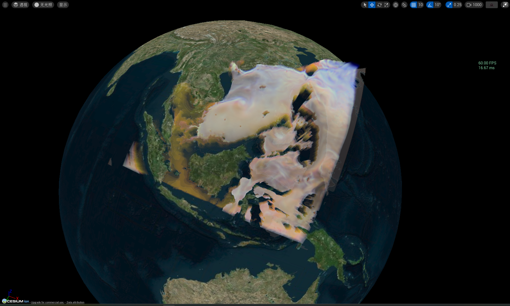

# VIS on Earth

VisOnEarth is a project enabling earth-scaled Visualization (mainly Scientific Visualization) in UE 5 with Cesium.

## Usage

The core library is encapsulated in [`Plugins/VIS4Earth`](./Plugins/VIS4Earth/README.md).

## Features

### Direct Volume Rendering

- [x] Direct Volume Rendering
- [x] Direct Volume Rendering with Pre-Integrated Method
- [ ] Direct Volume Rendering with Advanced Illumination

### Heat Map

- [ ] Heat Map (Slice Rendering)

### Isosurface Rendering

- [x] Marching Cube and Isosurface Rendering
- [ ] Marching Cube on GPU

### Isospleth Rendering

- [x] Marching Square and Isopleth Rendering
- [ ] Marching Square on GPU

## Gallery

### Direct Volume Rendering

